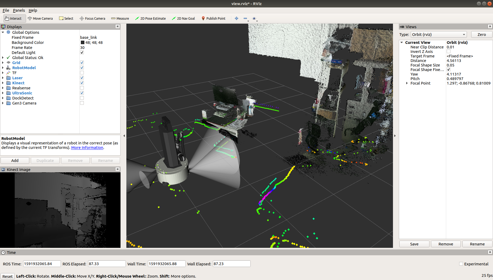
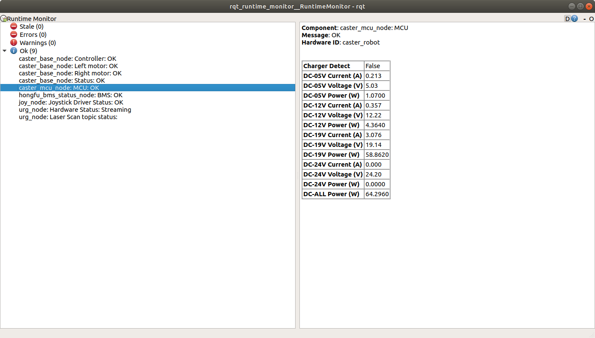
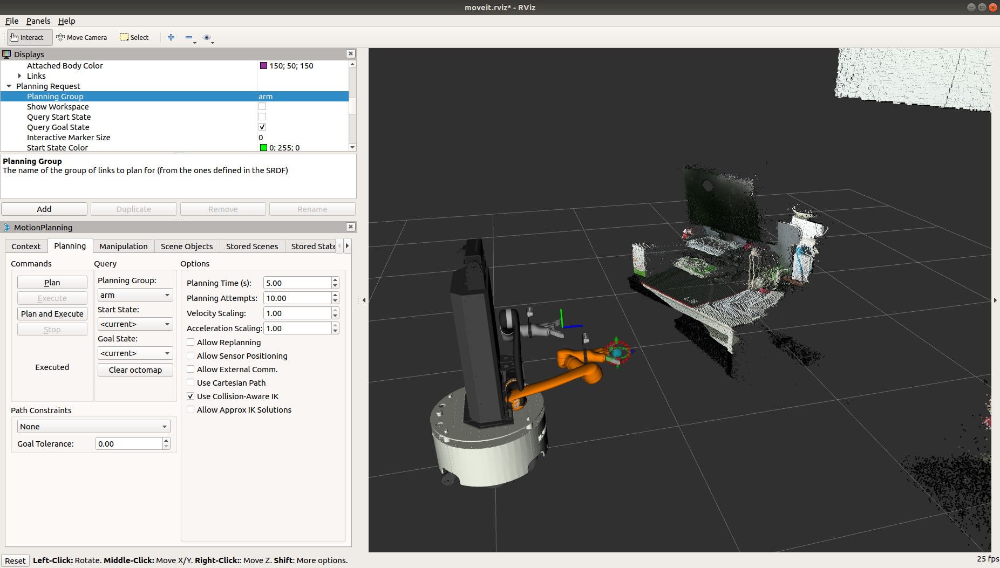

# 快速启动手册

## 前期准备

1. 参考《CasterMoma用户手册》，启动机器人
2. 连接显示器和无线键鼠到Caster地盘上，接口位置参考《CasterMoma用户手册》

## ROS功能启动

1. 使用`CTRL+ALT+T`启动一个新终端

2. 根据机械臂形态，在终端中输入如下指令之一，启动CasterMoma的控制程序，此launch文件会启动CasterMoma中所有的执行器和传感器

   ```bash
   # Kinova Gen3手臂
   roslaunch caster_moma_bringup caster_moma_gen3_bringup.launch
   
   # Kinova j2s6s300 手臂
   roslaunch caster_moma_bringup caster_moma_j2s6s200_bringup.launch
   
   # Kinova j2n6s300 手臂
   roslaunch caster_moma_bringup caster_moma_j2n6s200_bringup.launch
   ```

## 诊断信息和点云信息显示

1. 在终端中，使用`CTRL+SHIFT+T`启动一个新终端标签页，输入如下指令，使用Rviz来查看CasterMoma传感器的信息和点云视图

  ```bash
  roslaunch caster_moma_viz display.launch
  ```

2. Rviz视图

   

3. 机器人诊断信息视图

   

## 手柄控制

Caster可以使用手柄进行遥控，具体按键功能参考[手柄按键说明图](101-joystick_description.md)

1. 参考[ROS功能启动](01-quick_start.md#ROS功能启动)，启动Caster的ROS功能

4. 根据[手柄按键说明图](102-joystick_description.md)，操控Caster进行移动

5. 对于移动操作，只有在按下`安全键`的时候，信号才会被Caster接收到。

## 创建地图

1. 参考[ROS功能启动](01-quick_start.md#ROS功能启动)，启动Caster的ROS功能

2. 在终端中，使用`CTRL+SHIFT+T`启动一个新终端标签页，执行如下指令，启动建图

   ```bash
   roslaunch caster_navigation gmapping.launch
   ```

3. 在终端中，使用`CTRL+SHIFT+T`启动一个新终端标签页，运行如下指令，启动建图界面

   ```bash
   roslaunch caster_moma_viz display.launch type:=gmapping
   ```

4. 拔掉HDMI线，清空机器人周围的区域

5. 参考[手柄控制](01-quick_start.md#手柄控制)，启动手柄遥控，操控Caster完成地图建立

6. 建立完成后，重新接上显示器，开启一个新的终端，输入如下指令保存地图

   ```bash
   # 使用map_saver保存地图, 扫描后的地图推荐存放至caster_navigation的map
   rosrun map_server map_saver -f $(rospack find caster_navigation)/map/[地图名称]
   ```

**注意：在建立地图时，请勿将充电桩放置于地面上，地图建立完成后再放置充电桩**

## 定位导航

1. 参考[ROS功能启动](01-quick_start.md#ROS功能启动)，启动Caster的ROS功能

2. 参考[创建地图](01-quick_start.md#创建地图)，完成地图创建

3. 在终端中，使用`CTRL+SHIFT+T`启动一个新终端标签页，执行如下指令，启动导航功能

   ```bash
   # 使用map_file参数指定要加载的地图，例如加载home地图
   roslaunch caster_navigation navigation.launch map_file:=$(rospack find caster_navigation)/map/home.yaml
   ```

4. 在终端中，使用`CTRL+SHIFT+T`启动一个新终端标签页，运行Rviz，用来监控机器人状态

   ```bash
   roslaunch caster_moma_viz display.launch type:=navigation
   ```

5. 在Rviz中，设定机器人的初始位置

6. 根据需求设定机器人目标点，进行运动

## 使用机械臂

1. 参考[ROS功能启动](01-quick_start.md#ROS功能启动)，启动Caster的ROS功能

2. 在终端中，使用`CTRL+SHIFT+T`启动一个新终端标签页，根据机械臂型号和需求，选择如下指令启动机械臂的MoveIt控制功能，或仿真（仿真不需要启动Caster的ROS功能）。

   ```bash
   # 6自由度-2指-球关节 机械臂仿真
   roslaunch caster_moma_j2s6s200_config demo.launch
   # 6自由度-2指-球关节 机械臂真机
   roslaunch caster_moma_j2s6s200_config execute.launch

   # 6自由度-2指-非球关节 机械臂仿真
   roslaunch caster_moma_j2n6s200_config demo.launch
   # 6自由度-2指-非球关节 机械臂真机
   roslaunch caster_momn_j2n6s200_config execute.launch
   
   # Gen3 7自由度-2指 机械臂仿真
   roslaunch caster_moma_gen3_7d_2f85_moveit_config demo.launch
   # Gen3 7自由度-2指 机械臂真机
   roslaunch caster_moma_gen3_7d_2f85_moveit_config execute.launch
   ```

3. Moveit视图

   

## 自动充电功能

1. 参考[定位导航](01-quick_start.md#定位导航)，启动Caster的定位导航功能，并正确设置Caster在地图中的位置

2. 参考[自动充电原理和配置](03-auto_charge_description.md#参数配置)，完成对充电桩位置的设定

3. 在终端中，使用`CTRL+SHIFT+T`启动一个新终端标签页，运行如下指令，启动自动充电功能

   ```bash
   roslaunch caster_auto_charge auto_charge.launch
   ```

4. 按下手柄的`START`按键，Caster开始执行自动充电程序

5. 充电完成后，按下手柄的`BACK`按键，Caster从充电桩中推出

**注意：在Caster位于充电桩内时，勿使用导航功能，以免损坏Caster的受电模块。要使用导航功能，请确保Caster正确从充电桩中推出**